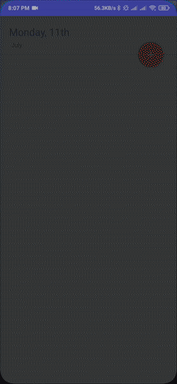

# Todo App
A simple todo app written using 
- MVVM Clean architecture pattern 
- dependency injection using koin
- Retrofit Rest API calls with interceptor
- https://jsonplaceholder.typicode.com/ as the sample api

## DEMO
 

